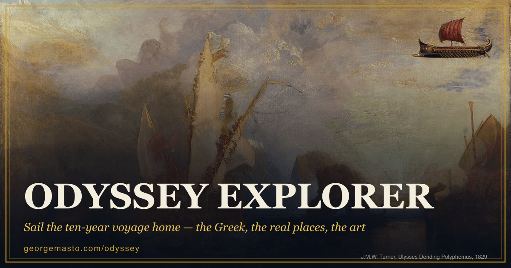
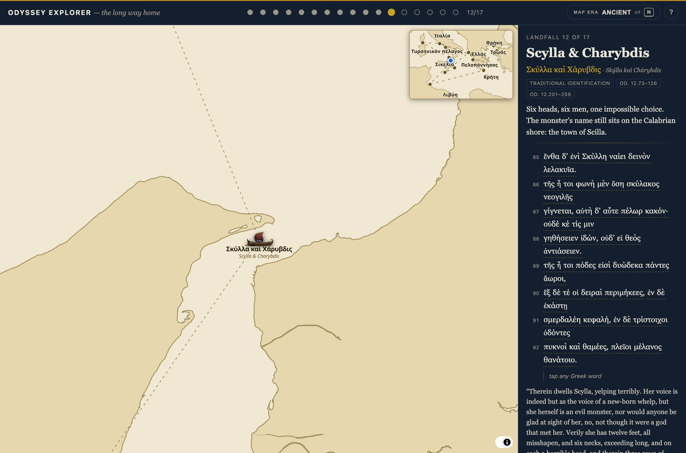
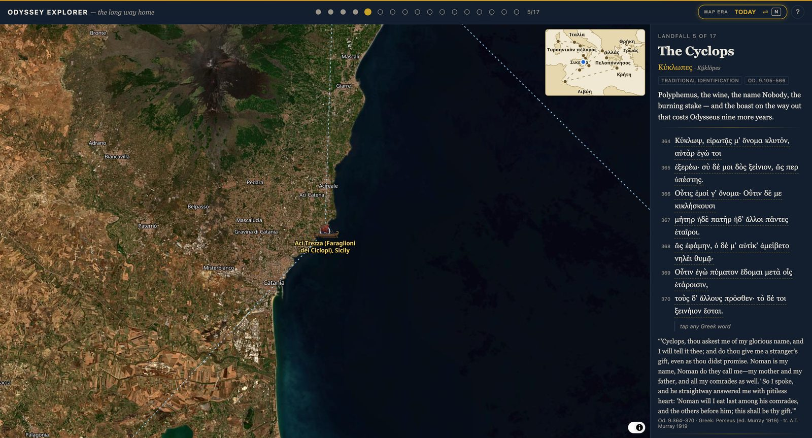

# Odyssey Explorer

**Sail Odysseus's ten-year voyage home — live at [georgemasto.com/odyssey](https://georgemasto.com/odyssey).**



Seventeen landfalls from Troy to Ithaca on a hand-styled ancient chart. Every stop
carries Homer's actual Greek — every word tappable for a gloss — plus the story,
etymology chains, sourced lore, and the art the scene inspired. Press **N** and the
ancient chart becomes today's satellite view: these are real places, and Scylla is
still a town called Scilla in Calabria.

## What you can do

- **Sail** with ← → arrow keys, or click any numbered stop, progress dot, or the trireme's next port
- **Tap any Greek word** — all 17 excerpts are fully glossed (the Cyclops's "Nobody" pun finally works in English)
- **Switch map eras** — ancient parchment ↔ modern satellite, with Google Maps links to the real places
- **Follow the ship** — it glides the route as a fixed minimap tracks the whole Mediterranean
- **Read the receipts** — etymologies (νόστος + ἄλγος → *nostalgia*), tidbits with citations, honest certainty tags (`secure / traditional / disputed / mythic`)

| The ancient chart | Press N — the world today |
| --- | --- |
|  |  |

## How it works

- **SvelteKit (static) + MapLibre GL** — one map, two worlds: the era toggle flips
  whole layer groups (`a-*` ancient / `m-*` modern). No backend, no tracking; every
  stop prerenders to a real URL with its own social card.
- **Content is data** — one Markdown+frontmatter file per stop in
  [content/stops/](content/stops/): coordinates, Greek excerpt, word-by-word
  interlinear, etymology, tidbits, art with attribution.
- **The Greek can't drift** — excerpts are extracted from the vendored Perseus TEI
  editions ([sources/perseus/](sources/perseus/)) via
  [scripts/perseus.mjs](scripts/perseus.mjs), and CI
  ([scripts/validate-content.mjs](scripts/validate-content.mjs)) re-checks every
  line byte-for-byte, verifies interlinear tokens rejoin their lines, and rejects
  unsourced tidbits or non-free art licences.
- Satellite: EOX Sentinel-2 cloudless. Basemap data: OpenStreetMap via OpenFreeMap.
  Social cards are generated by [scripts/generate-og.mjs](scripts/generate-og.mjs).

## Run it

```bash
npm install
npm run dev        # http://localhost:5173/odyssey
```

`npm run build` prerenders the whole site into `build/`;
`node scripts/validate-content.mjs` runs the content checks CI runs.

## Licences & credits

Code is MIT ([LICENSE](LICENSE)). Content carries its own terms, all listed on the
site's [about page](https://georgemasto.com/odyssey/about): Greek text from the
Perseus Digital Library (CC BY-SA 4.0), A.T. Murray's 1919 translation (public
domain), artworks public domain / CC via Wikimedia Commons (attributed per stop),
map data © OpenStreetMap contributors (ODbL) via OpenFreeMap, satellite imagery
Sentinel-2 cloudless by EOX (CC BY-NC-SA 4.0, contains modified Copernicus
Sentinel data).
